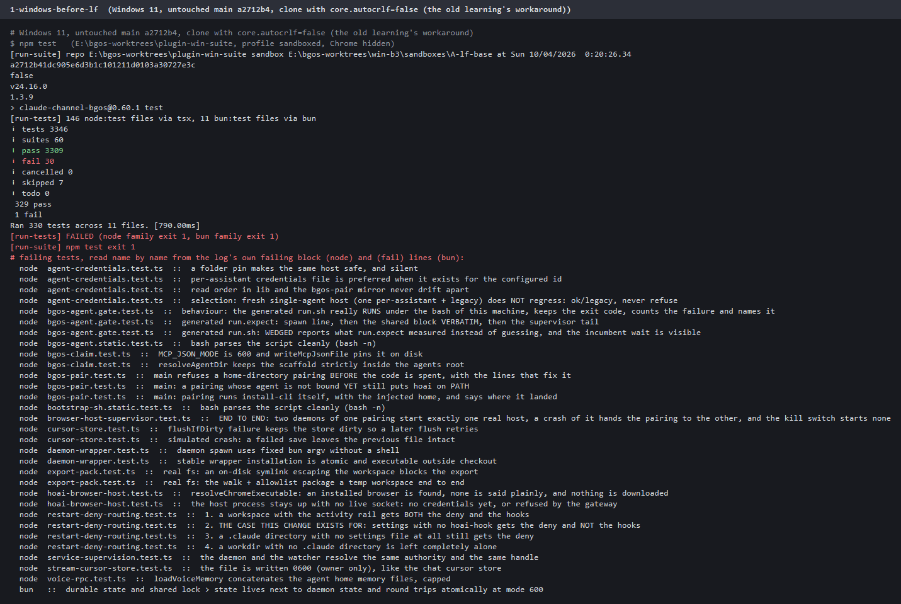
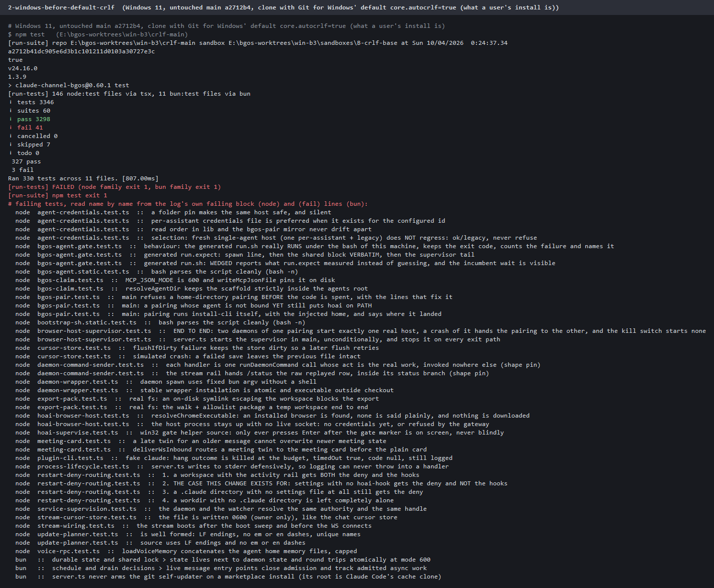
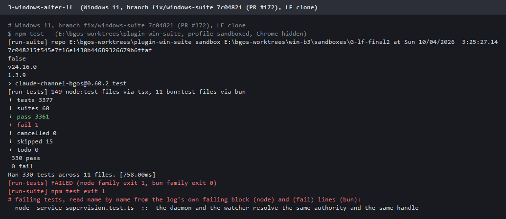
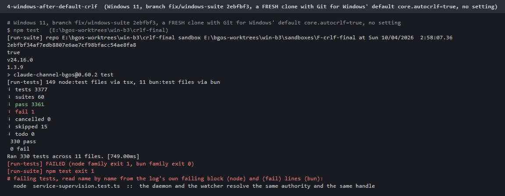
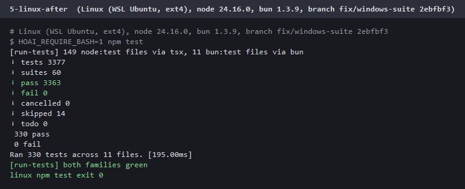
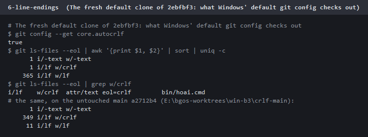
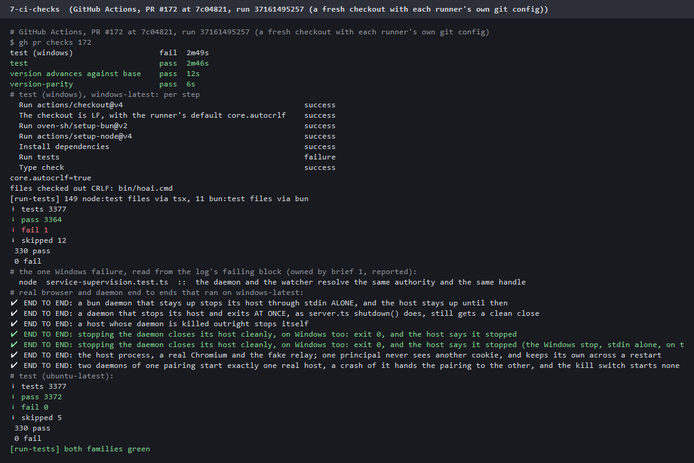

# Evidence: the plugin suite on Windows (brief 3, code PR #172)

Evidence only, no code. The change it backs is **PR #172** (`fix/windows-suite`): every Windows failure of the suite
triaged, three Windows bugs fixed in the product, the test assumptions fixed without weakening them, `.gitattributes`
pinning LF, and a `test (windows)` CI leg.

Every image is a render of a real log, verbatim, made on the Windows box (Windows 11, node 24.16.0, bun 1.3.9) with
PowerShell System.Drawing: the title names the run, and the text beside each image (`.txt`) is the exact input. The
failing names at the bottom of each are read from the log's own `failing tests:` block (node) and `(fail)` lines (bun),
name by name, never from a count. Every run used the same harness: `npm test` from cmd with the profile pointed at an
empty sandbox, Chrome hidden (`HOAI_BROWSER_EXECUTABLE` at a missing path) and every relay or credential variable
cleared, after a read-only audit of all 157 test files. A fingerprint of the real profile's agent state was identical
before and after every run.

| | What | node | bun |
|---|---|---|---|
|  | **Before**, untouched `main` `a2712b4`, a clone made with the old workaround `core.autocrlf=false` | 30 fail / 3346 | 1 fail / 330 |
|  | **Before**, untouched `main`, a clone with Git for Windows' default `core.autocrlf=true` (what a Windows install is) | 41 fail | 3 fail |
|  | **After**, `fix/windows-suite` `7c04821` (the PR head), LF clone | **1 fail** / 3377 (15 skipped, each with its reason) | **0** / 330 |
|  | **After**, a FRESH clone of `2ebfbf3` with the default `core.autocrlf=true` and no setting (`7c04821` changed two tests since; its fresh default checkout is the CI row) | **1 fail** / 3377 | **0** / 330 |
|  | **After**, Linux (WSL, ext4), `HOAI_REQUIRE_BASH=1`, `2ebfbf3` | **0 fail** / 3377 | 0 / 330 |
|  | The fresh default clone checks out every text file LF except the batch file (365 LF, `bin/hoai.cmd` CRLF); untouched `main` checked out 349 files CRLF | | |
|  | **CI on PR #172 at `7c04821`**: `test` (ubuntu) passes; `test (windows)` fails on the one reported test only. Its CRLF check, install and type check pass, the runner really is on `core.autocrlf=true` with only `bin/hoai.cmd` CRLF, and every real browser and daemon end to end ran there and passed, the real Chrome one for the first time on Windows | 1 fail / 3377 (Windows), 0 / 3377 (ubuntu) | 0 / 330 both |

**The one remaining Windows failure** is `the daemon and the watcher resolve the same authority and the same handle`
in `test/service-supervision.test.ts`, which belongs to the parallel Windows supervisor change (brief 1) and was
reported to it rather than touched: `lib/update-readiness.ts` joins the launchd and systemd paths with the host's
`path.join` against the test's POSIX fixture home, while the watcher keeps the input's separators. No user impact.

**Triage of every failure:** [triage-table.md](triage-table.md), 44 rows (the 31 on the LF clone plus the 13 that only
a default CRLF clone showed): 3 real Windows bugs fixed in the product, 27 tests that assumed POSIX fixed in the test,
12 line-ending failures fixed by `.gitattributes` with the test unchanged, 1 environment prerequisite, 1 owned by
brief 1.

**Two more, seen only on GitHub's Windows runner** (first CI run of the new leg), both reproduced on this box and
both test environment: the runner's temp folder is an 8.3 short name (`RUNNER~1`) that node's JS `realpathSync` keeps
while Git prints the long name, and Chrome refuses remote debugging when the test's fake `USERPROFILE` has no
`AppData\Local` (a probe matrix pinned it to that alone). Fixed in the tests in `7c04821`; the second CI run above
is the result.

**Mutation proof:** [mutations.log](mutations.log) holds every run in full: the diff applied to the product (or config)
file, the test run, the assertion that fired, and the byte-identical restore. [mutation-table.md](mutation-table.md)
summarises it: 89 runs (54 on Windows, 35 on Linux), all restored byte-identical, 87 red for the stated reason. Two
first tries stayed green and both are kept in the log: `procs-swallow` exposed a failure path no test covered (a test
was added, then it went red), and `e2e-profile` removed only an env redirect when the cause was the missing
`AppData\Local` folder (re-aimed at the folder, it went red, real Chrome on Windows).
